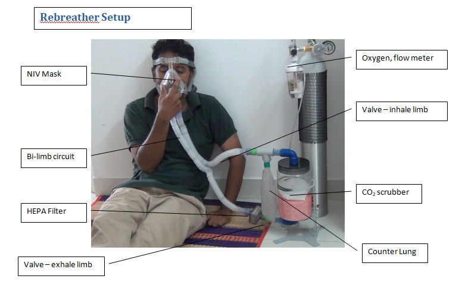
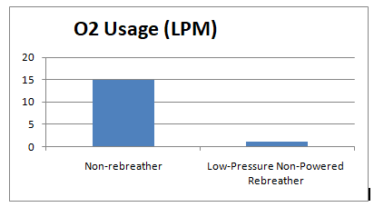

## A Rebreather For Achieving Oxygenation During Oxygen Shortage in COVID-19 Crisis

The second COVID19  surge has resulted in half-a-million deaths with estimates of surpassing 1 million deaths by August 1st, 2021. The surge has strained the healthcare system in India leading to hospitals running out of oxygen supply. 

An approach to recirculate exhaled oxygen during utilization would be tremendously impactful as a means of alleviating the oxygen shortage. The following is the setup:

We performed a benchmark study to test the gas utilization on a volunteer. 

- We found significant increase in work of breathing as per clinical observation and volunteer feedback but due our limited setup we are not able to quantify in absolute terms. However this was not to a level of discomfort that mandated removal of device.
- We did a post exercise test (respiratory rate 25 BPM and clinically observed tidal volume of about 2L) and found that with the system was able to sustain the respiratory needs of the volunteer.
- Long term ventilation for 6 hrs using 2LPM medical air did not product any discomfort nor clinical signs of hypercapnia. Hence we are confident that 2kg Sodalime CO2 scrubber is able to wash out CO2 in the circuit to normal breathable levels.

**We are confident this device would be effective with patients on non-rebreather and standard oxygen masks. The savings in oxygen could be 15 fold.  A B type cylinder that lasts for 1 hour on a non-rebreather mask can be extended to 15 hours using this rebreather.**

### Bill of Materials

No. | Item | Brand | Supplier | Cost (Rs)
----|----- | ------| ---------| ----
1	| Collapsible bi-limb circuit with NIV Mask | Adlisc | Surgiplus | 1200
2|Oxygen Mask with Reservoir Bang|Adlisc|Surgiplus|107
3|HEPA filter|Adlisc|Surgiplus|177
4|Intersorb 2179 Colour changing Sodalime|Intersorb|Intersurgical|1475
5|Non-return valves|3D printed||200
6|Sodalime container, 3/4" elbows and coupling|Plumber shop||100
7|Stand|Custom made||500

### Supplier Details
Circuits Mask and Non-rebreather | Circuits Mask and Non-rebreather |	Sodalime
----|----- | ------
SURGIPLUS Plot No:02, 5th Cross, Gnanaprakasam Nagar, Puducherry-605008 GSTIN/UIN: 34AAXPA8651J1Z9 Puducherry surgiplus3@gmail.com | Starmed Health Care Pvt Ltd,36A, Rajiv Nagar, 1st Street, Pallikuppam, Chennai 600 077 Ph: 75502 20007/75502 20008 | Hospitech Agencies 94860 31584 Numerous suppliers from Indiamart supplying medical Sodalime

